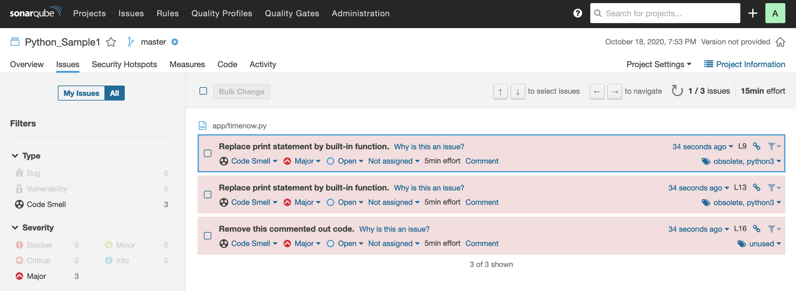
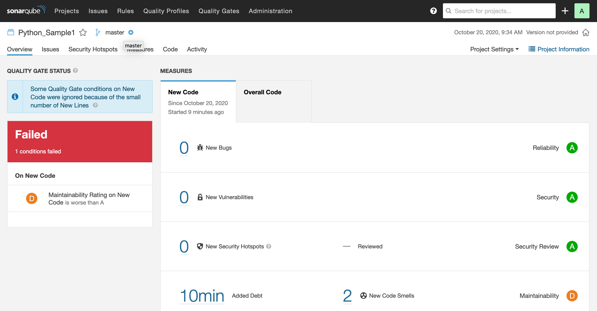
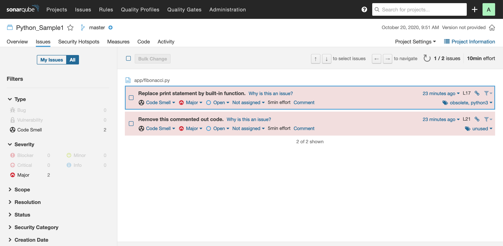
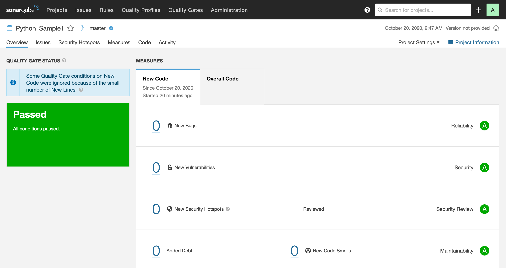

# Docker-Sonarqube

Full [SonarQube](https://www.sonarqube.org/) environment running on top of Docker and other cool stuff.

## Description

SonarQube is an open-source platform developed by SonarSource for continuous inspection of code quality to perform automatic reviews with static analysis of code to detect bugs, code smells, and security vulnerabilities on 20+ programming languages.

The aim of Docker-Sonarqube is to provide a fully functional SonarQube in a lightweight environment such Docker to ease Sonar learning curve and experiment with a fully fledged setup close to a production system. To make things more close to real, [traefik](https://hub.docker.com/_/traefik) provides a HTTP/HTTPS reverse proxy along with https://traefik.me which provide a  wildcard DNS for any IP address with HTTPS support.

<!--  -->


### Dependencies

- Docker: www.docker.com

- jq: https://stedolan.github.io/jq  

## Getting Started

- Quickstart
    - git clone
    - make up
    - Go to https://sonar.traefik.me and wait untill SonarQube is up and running.
    - make create_token
    - make code_python
    - Log into https://sonar.traefik.me (admin:admin) and check Sonar results for Python_Sample1 project.

## SonarQube at work

The main duty of SonarQube is to perform static analysis and checks on the code. So, let's put it at work.

Once you have Sonar up and running and you perform `make code_python`, SonarScanner will submit the python
code within the app directory, timenow.py has a few intentional errors that would flag some errors in the
such `Replace print statement by built-in function.` and `Remove this commented out code.` Sonar rules have a section of "Why is this an issue?" where the error is explained and a remediation is provided following the best
coding practices for the language in use.

`make code_python`

Result: https://sonar.traefik.me/dashboard?id=Python_Sample1



---

Issues: https://sonar.traefik.me/project/issues?id=Python_Sample1&resolved=false




- **The "print" statement should not be used:**
  - The print statement was removed in Python 3.0. The built-in function should be used instead.

- **Sections of code should not be commented out**
    - Programmers should not comment out code as it bloats programs and reduces readability. Unused code should be deleted and can be retrieved from source control history if required.


To clean our code we must amend it.

Bad
```python
#!/usr/bin/env python3

def fibo(n):
   if n <= 1:
       return n
   else:
       return(fibo(n-1) + fibo(n-2))

nterms = 30

# check if the number of terms is valid
if nterms <= 0:
   print("Plese enter a positive integer")
else:
   print("Fibonacci sequence:")
   for i in range(nterms):
       print fibo(i)

## Comments in code are good, commented code not :) .


# if __name__ == '__main__':
#     fibonaccy.main()

```

Good
```python
#!/usr/bin/env python3

def fibo(n):
   if n <= 1:
       return n
   else:
       return(fibo(n-1) + fibo(n-2))

nterms = 30

# check if the number of terms is valid
if nterms <= 0:
   print("Plese enter a positive integer")
else:
   print("Fibonacci sequence:")
   for i in range(nterms):
       print (fibo(i))

## Comments in code are good, commented code not :) .
```    

The rerun the static code analysis.

`make code_python`




The code has successfully passed Python code compliance test.


## Authors

Phillip Bailey - www.bailey.st
